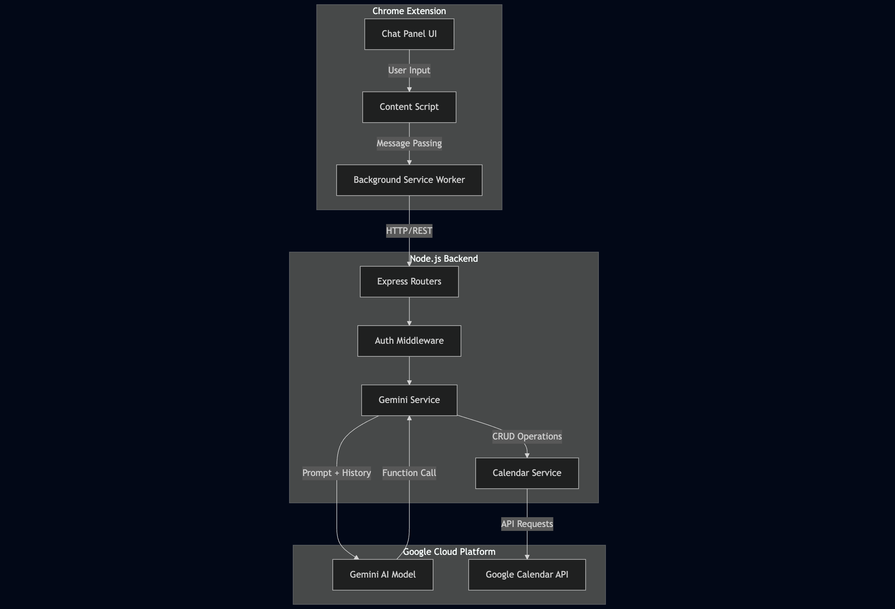
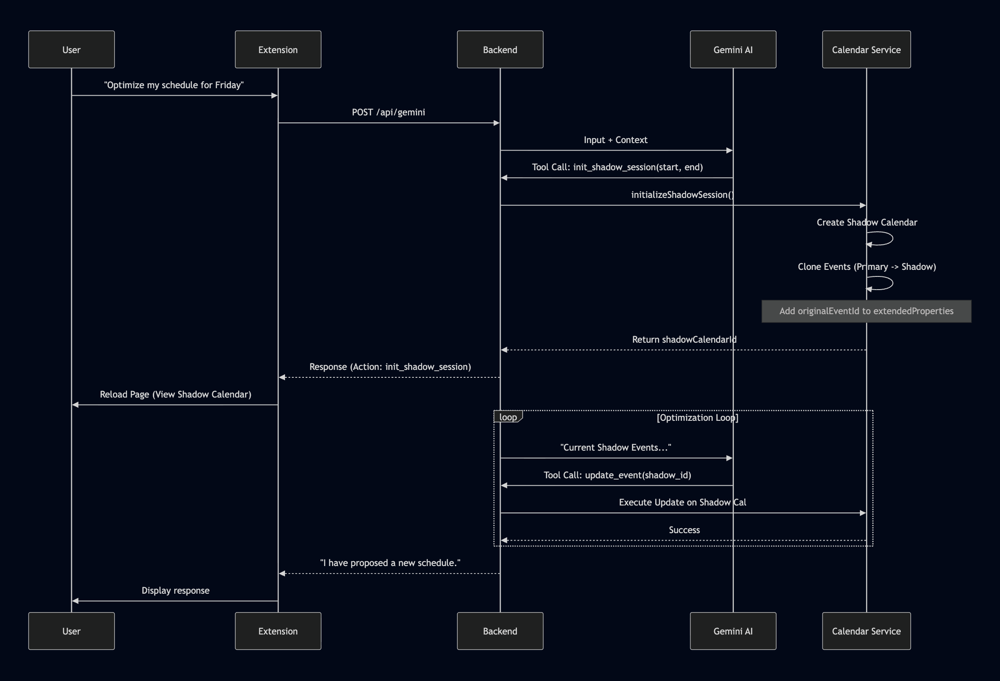

# System Architecture and Workflow

## 1. Architectural Overview

The Google Calendar Assistant follows a **Client-Server-Provider** architecture. It decouples the user interface (injected into the browser) from the logic processing (Node.js server) and the data storage (Google APIs).

### High-Level Component Diagram

## 2. Detailed Workflows

### 2.1 Authentication Flow (OAuth 2.0)

The system uses a backend-mediated OAuth flow to keep client secrets secure.

1. **Initiation**: The user clicks "Sign in with Google" in the extension sidebar.

2. **Request**: The background service script (`background.js`) requests an authorization URL from the authorization endpoint (`/api/auth/authorize`).

3. **User Consent**: The extension opens the returned Google OAuth URL. The user grants calendar scopes.

4. **Callback**: Google redirects to the backend callback URL.

5. **Token Exchange**: The backend exchanges the authorization code for an *Access Token* and *Refresh Token*.

6. **Handover**: Tokens are passed back to the extension and stored in the browser's local storage (`chrome.storage.local`).

### 2.2 The Chat Processing Loop

This workflow describes how a user message is processed and converted into a calendar action.

1. **Input Capture**: The chat panel interface script (`panel.js`) captures user input and sends it to the content injection script (`content.js`).

2. **Relay**: The content injection script (`content.js`) relays the message to the background service script (`background.js`).

3. **API Call**: The background service script (`background.js`) attaches the Access Token and POSTs the payload to the Gemini interaction endpoint (`/api/gemini`).

4. **Context Injection**: The Gemini service module (`geminiService.js`) injects the current server time and user timezone into the prompt to ground the AI temporally.

5. **AI Reasoning**:

    - The prompt and conversation history are sent to Gemini.

    - Gemini determines if it needs more information (Context Gathering) or if it can perform an action.

6. **Tool Execution**:

    - If Gemini returns a tool call (e.g., the event creation tool (`createEvent`)), the backend executes the corresponding function in the calendar service module (`calendarService.js`).

    - The result is fed back to Gemini to generate a natural language confirmation.

7. **Response**: The final text is returned to the extension UI.

### 2.3 Smart Reschedule (Shadow Session) Architecture

This is the system's most advanced feature, allowing for safe complex scheduling.

#### Logic Flow

1. **Intent Detection**: Gemini detects a request requiring complex manipulation (e.g., "Reschedule my afternoon"). It calls the shadow session initialization tool (`init_shadow_session`).

2. **Shadow Initialization**: The calendar service module (`calendarService.js`) performs the following:

    - A new temporary calendar is created via the API.

    - Events from the user's primary calendar within the specified range are fetched.

    - Events are cloned to the Shadow Calendar.

    - **Lineage Tracking**: The original event ID is saved in the cloned event's private metadata field (`extendedProperties.private.originalEventId`). This is critical for mapping changes back to the real calendar later.

3. **Context Switching**: The backend returns the shadow calendar identifier (`shadowCalendarId`). The extension detects this and reloads the Google Calendar page to display the Shadow Calendar view.

4. **Iterative Reasoning**:

    - Gemini enters a loop where it analyzes the cloned events.

    - It performs fuzzy matching using the potential match finding function (`findPotentialMatches`) to link user intent (e.g., "gym") to specific calendar events.

    - It executes updates or deletions on the Shadow Calendar ID only.

5. **Proposal**: The user sees the modified schedule visually on the Shadow Calendar.

#### Sequence Diagram: Shadow Session

### 2.4 Context Gathering Strategy

To avoid blind actions, the backend implements a context gathering step (`gather_context`).

1. Gemini may decide it doesn't have enough info (e.g., user says "Reschedule the meeting" but hasn't specified which one).

2. Gemini calls the context gathering tool (`gather_context`) with search parameters.

3. The backend performs a read-only event listing (`listEvents`) or event search (`searchEvents`).

4. The results are appended to a follow-up prompt: "Here is the calendar context you requested...".

5. Gemini uses this new data to make the final update (`update`) or delete (`delete`) decision.

## 3. Project Structure

### Backend (`/backend`)

- `src/index.js`: Entry point. Sets up Express server and middleware.

- `src/routes/`: Defines API endpoints (`gemini`, `oauth`, `calendar`).

- `src/services/geminiService.js`:

  - Manages the AI conversation loop.

  - Handles the recursive logic for Shadow Sessions.

  - Implements fuzzy matching for event identification.

- `src/services/calendarService.js`:

  - Wraps the Google library (`googleapis`).

  - Handles raw API calls for events and calendars.

  - Implements the cloning logic for Shadow Sessions.

- `src/models/CalendarEvent.js`: Data model validation for calendar events.

### Extension (`/extension`)

- `manifest.json`: Configuration for Chrome, defining permissions and content scripts.

- `background.js`: Service worker handling token storage and OAuth window management.

- `scripts/content.js`: The bridge script that listens for UI events and communicates with the background worker.

- `components/chat-panel/`: Contains the UI implementation (HTML/CSS/JS) for the assistant interface.

## 4. Key Algorithms and Data Structures

### Fuzzy Event Matching

Located in the Gemini service module (`geminiService.js`), the potential match finding function (`findPotentialMatches`) links natural language descriptions to specific events.

- **Logic**: It tokenizes the user's input and compares it against event summaries.

- **Scoring**: It assigns a confidence score based on word overlap and phrase containment.

- **Usage**: Used primarily during Shadow Sessions to identify which existing event the user wants to modify without needing an explicit Event ID.

### Calendar Context Resolution

The calendar resolution helper (`resolveCalendarId`) ensures operations target the correct calendar layer.

- If a Shadow Session is active, it overrides the default "primary" ID with the shadow calendar identifier (`shadowCalendarId`).

- This prevents accidental writes to the production calendar during simulation.
